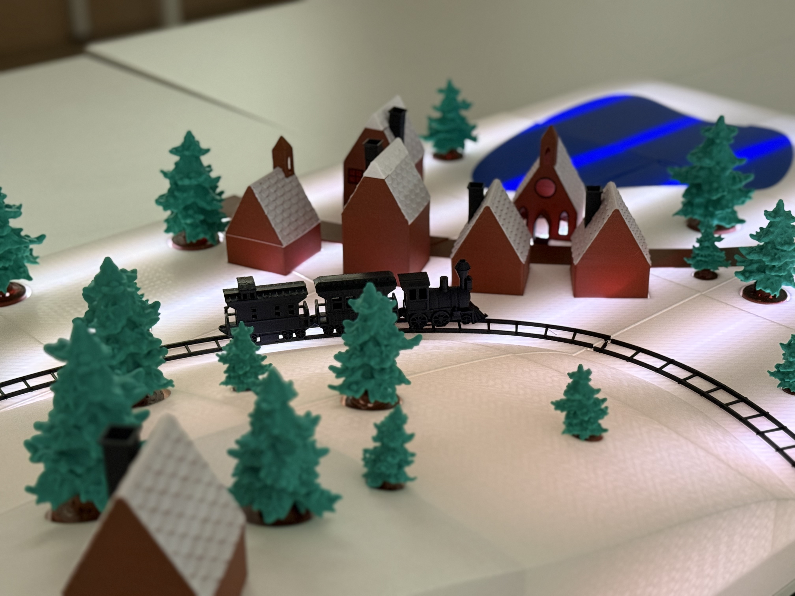
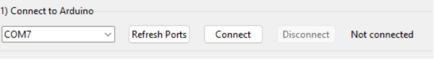

# Winter Wonderland LED Display Code
Code for the 3D printed winter wonderland display found on Makerworld here: [add link later]
Run Git clone to clone this repository to start.



## Arduino and LED Strip
Use Arduino UNO and WS2812 LED Strip.

WS2812 Data Pin on Pin 4, with 300 LEDs, or set NUM_LEDS and DATA_PIN in [main.cpp](./Arduino%20Code/src/main.cpp)

Flash [main.cpp](./Arduino%20Code/src/main.cpp) to Arduino Uno over serial, I use PlatformIO, and [Arduino Code](./Arduino%20Code/) is set up as a Platform IO project. But you can copy [main.cpp](./Arduino%20Code/src/main.cpp) to Arduino IDE. 

Arduino needed libraries:
    Platform IO:
    `fastled/FastLED @ ^3.10.3`

or FastLED on Arduino IDE


## Controlling LED Lights With python GUI:
[Python LED Display GUI Code](./Python%20LED%20Display%20GUI%20Code/) contains the python script for controlling the LEDs via a GUI. 

From [LED Display GUI Code](./Python%20LED%20Display%20GUI%20Code/) run
```
pip install -r requirements.txt
```

Then run:
```
python led_gui.py
```

From the GUI, connect to the serial port the Arduino UNO is on.


Then, set LEDs with the provided controls. Can also save/load presets as .txt or .json files, to save a pretty configuration of LEDs. Note, this can be a little finnicky at times. May need to try a few times to get it to load correctly.